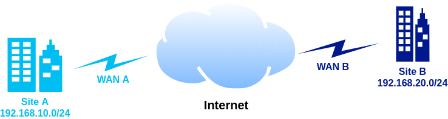

# WireGuard Site-to-Site VPN

1. Pre-requisites
2. Virtual Machines
3. OS and networking
4. Wireguard configuration
5. Site routing configuration

## 1. Pre-requisites

* Public IP Address or dynamic DNS on WAN links
* Hypervisor in each site in order to create the linux virtual machine (*not mandatory)
* Management access to the routers configuration in each site to configure port forwarding and static routes

*You can use a physical computer/server running linux instead of a virtual machine
